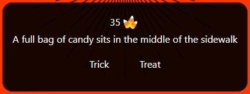
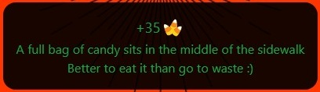
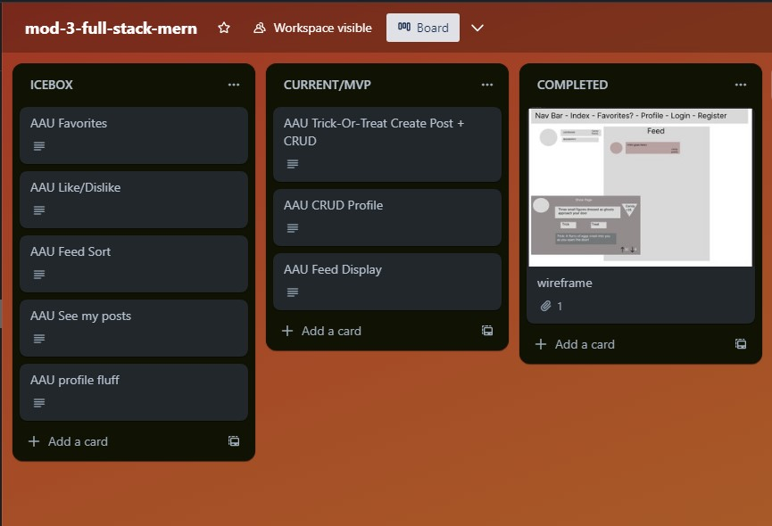
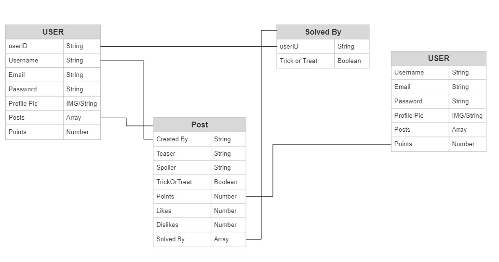
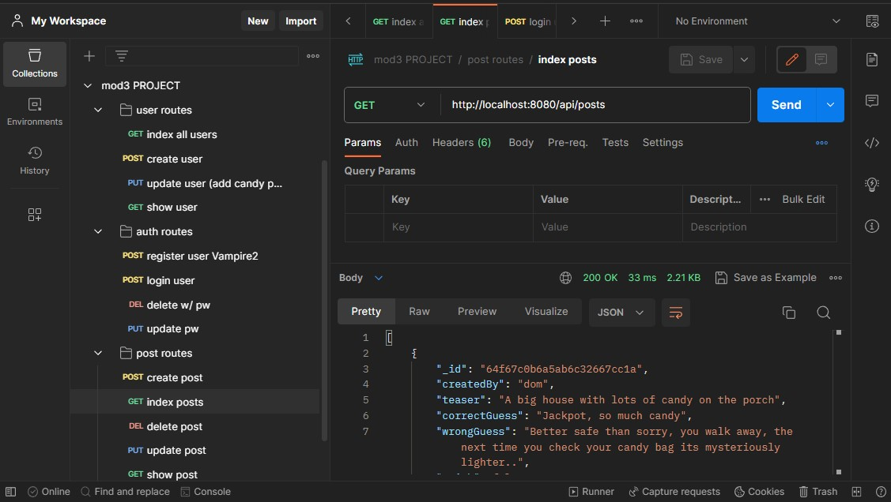
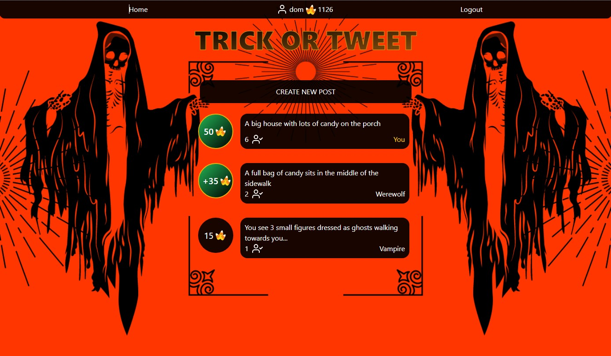

# Trick or Tweet, A MERN Stack application

The objective of this project was to create a full stack web application using React, Express, Node, and MongoDB/Mongoose.

This website simulates a virtual Halloween experience. users create posts describing a situation with a hidden outcome of a trick or a treat. When other users interact with the post they must use the description and their wits to guess the correct outcome. 

To keep everyone feeling mischievous and in the spirit of the holiday there is a point system represented as candy. You must spend candy to create posts, but every time someone guesses wrong on your trick-or-treat you get the candy back. When they guess correctly candy is generated for them at no cost to the post creator.

## Live Deployment
[View Project Here](https://trick-or-tweet-frontend.onrender.com/)

## Motivation
This is the final project of the third module of my Software Engineering bootcamp. The final, final project.

### The requirements for this project were: 
Due to the scope of the project, using planning tools was required.

1. Trello board with sectons for: Icebox, Current/MVP, Completed, a wireframe, and an Entity-Relationship-Diagram. Features were implemented based on user stories.
2. Source code hosted on GitHub and the project deployed live.
3. A functioning full-stack, single-page application for (Express) and a CDN service for (React).
4. Incorporate the technologies of the MERN-stack (MongoDB/Mongoose, Express, React, Node).
5. Have a well-styled interactive front-end that communicates with the Express backend via AJAX.
6. Implement token-based authentication - "...a user can sign-up, log in & log out".
7. Implement authorization by restricting functionality to authenticated users.
8. Navigation should respond to the login status of the user.
9. One User data entity minimum, which will be used for Auth; other data entities can be added and related if desired but are not required.  
10. Have a comprehensive feature-set. Full CRUD distributed across all Data Entities.

## Screenshots
After creating a wireframe mockup using [Figma](https://www.figma.com/). I attached it to a [Trello](https://trello.com/)board and began creating user stories of the features I wanted implemented.

Next I created an ERD using a trial to [SmartDraw](https://cloud.smartdraw.com/). As they say, no plan survives contact with the enemy and my inital structure was too complicated. For the final product I switched from a reference Solved By collection to embedding the data in the Post array.

 

Next in the process was to begin coding. I started with the backend because it was fresh in my mind and I could utilize [Postman](https://www.postman.com/) to test the functionality of my routes without a client. 

    

Last up was designing the React frontend. Here is the finished product:

## Framework
Built in VS code

Frontend:
- React
- Vite: for generating a boiler plate react setup
- React-router-dom: to replicate a multipage website in a single page system 
- axios: for easy one line await-fetch
- tailwindCSS: for all styling
- react-feather: for some cool profile icons

Because I never had to pass props more than 1 level deep there was no need for context/redux.

Backend:
- Express
- cors: to allow the front and back end to communicate
- dotenv: to enable environment variables to protect sensitive data like passwords
- mongoose: to build Schemas for mongoDB
- bcrypt: to hash encrypt user passwords
- jsonwebtoken: to generate authentication tokens for users to signup/login

## Features

- One of my main goals outside of functionality was to make sure this project didn't look like it was made in the 90's. The standout ways I achieved this were: 
    - Rounded edges on everything.
    - Semi-transparent backgrounds with increased transparency on hover of interactable objects. 
    - Link's have hover effects of underlines/borders to cue functionality while keeping their static display clean.
    - Don't overdo the gradients!!!
- Responsive design using flexbox and tailwind breakpoints so the pages adjusts and look good on desktop and mobile.
- Gamified systems to encourage the spirit of Halloween. The goal is to trick each other, but not at the expense of fun. If you run out of points you can always refill back to 100, so users are never locked out of playing without diminishing the value of collecting large amounts of points.
- Token-based authentication to allow users to sign-up, log in & log out.
- Full CRUD operation for both user data and their created posts.
- Conditional navigation routing restricting access based on whether you are logged in or not.
### Not Yet Implemented:
 
#### Frontend:
- Main feed features:
    - Abiltiy to sort the feed (All, Solved, Unsolved, ect.)
    - Paging or similar feature so the posts arent all displayed at once
- Post features:
    - Favorites
    - Likes/Dislikes
- Profile features:
    - Leaderboards for most points
    - Bio information and profile pictures
#### Backend:
- More robust token authentication. Currently the routes only check if the token is valid, they do not verify that sender of the token is the same as the user whos data is being changed.

## Credits
- [Canva](https://www.canva.com/templates/EAEIA3OwQHU-black-and-orange-ghost-vintage-horror-illustrative-halloween-virtual-background/) For an awesome free background image
- [coolors.co](https://coolors.co/generate) for color themes.
- Design tools (listed above but here they are again):

    - [Figma](https://www.figma.com/)
    - [Trello](https://trello.com/)
    - [SmartDraw](https://cloud.smartdraw.com/)
- [Postman](https://www.postman.com/) for testing backend routes <3
- [Feather Icons](https://feathericons.com/) for great svg icons.
- [Spooky music](https://www.youtube.com/watch?v=hD3zDZ4-6Wg&ab_channel=IfeelImmortal) I didn't end up using it but heres some cool nocopyright music to get you in the spirit. 
